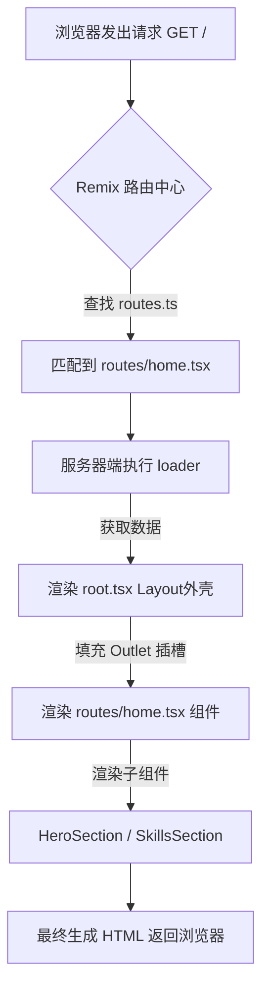

# Remix v7 渲染流程与核心哲学

这份文档详细记录了从 Lovable (Vite SPA) 迁移到 Remix v7 (React Router v7) 后，页面的加载逻辑和组件嵌套关系。

## 1. 核心渲染流程 (Request to Render)

当用户在浏览器输入网址或点击链接时，发生以下流程：

## 2. 文件层级与嵌套关系

### Step A: 路由表 (`app/routes.ts`)
这是整站的"地图"。它告诉 Remix：当访问某个路径时，加载哪个文件。
- **作用**：URL → 处理文件 的映射映射管理。

### Step B: 应用外壳 (`app/root.tsx`)
这是页面的根布局，包含 `<html>`, `<head>`, `<body>`。
- **`<Outlet />` 魔法**：它是路由内容的"插槽"。无论访问哪个路由，内容都会被塞进这个位置。
- **共享资源**：CSS 引入、Google Fonts、全局样式都在这里定义。

### Step C: 路由页面 (`app/routes/home.tsx`)
这是具体的页面逻辑中心。它包含：
- **`loader()`**: **服务端逻辑**。在页面渲染前运行，查询数据库或 API。代码在浏览器中不可见，极其安全。
- **`meta()`**: **SEO 逻辑**。动态设置页面的标题和描述。
- **`Default Component`**: **UI 模板**。接收 `loader` 返回的数据并作为 props 传给下游组件。

### Step D: 自定义组件 (`app/components/*`)
这些是从 Lovable 移植过来的功能块。
- **数据流向**：`Loader` → `Route Page` → `Props` → `Component`。
- **示例**：`SkillsSection` 不再拥有自己的数据，而是通过 `props.skills` 接收数据。这使得组件变得"纯粹"，只负责显示。

## 3. 为什么这样设计？ (The "Why")

1.  **首屏速度 (SSR)**：因为 HTML 在服务器端已经根据数据渲染好了，用户打开页面即见内容，不用等 JS 下载完再加载数据。
2.  **SEO 友好**：爬虫可以直接抓取到 `loader` 渲染出的完整内容。
3.  **安全性**：所有的数据库操作、API Key 都在服务器端的 `loader` 里，不会暴露给前端。
4.  **全栈开发体验**：前端 UI 和后端数据逻辑写在同一个文件里，不需要为了一个简单的页面去维护两套独立的工程。

---

*这份文档由 Antigravity 整理，旨在帮助从客户端渲染模式过渡到全栈 Remix 开发模式。*
